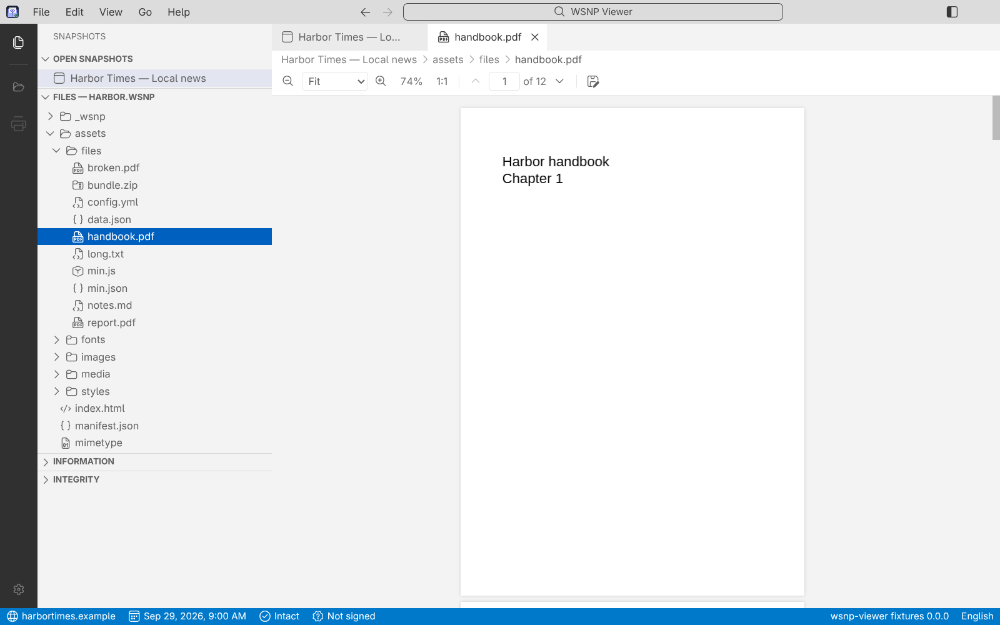
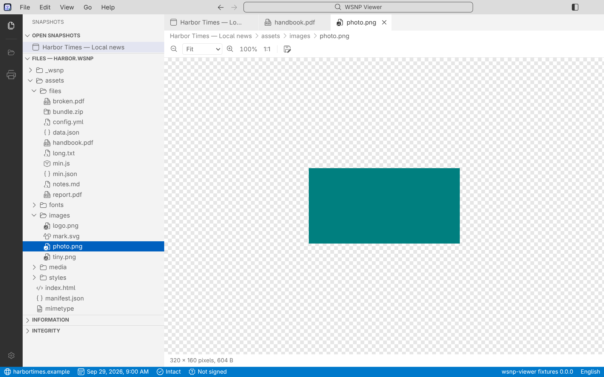
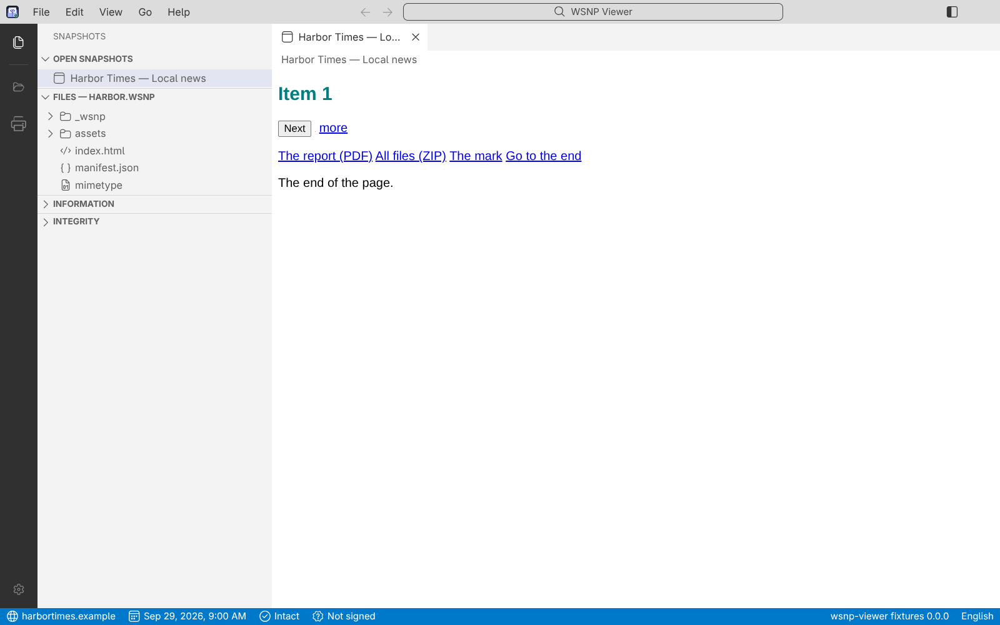
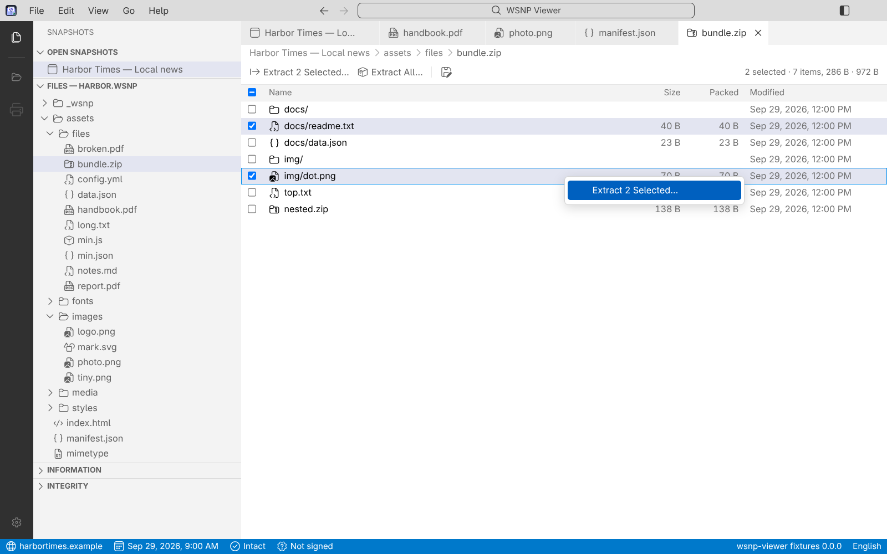
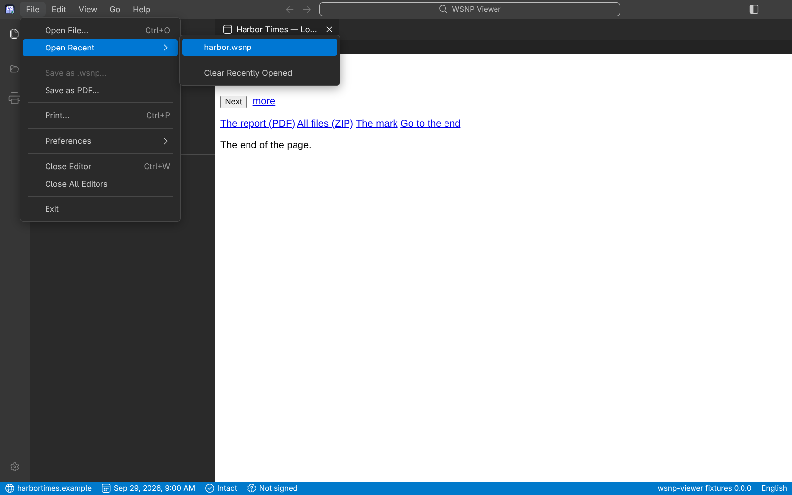

# WSNP Viewer


A desktop viewer for **WSNP** files (`.wsnp`): web pages saved to be read offline, written by the
[PageKeep](https://github.com/asantos43/webpage-snapshot) browser extension. A `.wsnp` is a **container**: one file (a ZIP) that holds a
page, every file the page needs, and a manifest that says what each one is and how to check it. The viewer opens it without unzipping it, shows
the page exactly as it was, checks that nobody changed it, and never lets it reach the network.

It runs on Linux, Windows and macOS, is built with Electron and TypeScript, and looks and behaves like Visual Studio Code's Dark+ and Light+.
English and Brazilian Portuguese, following the system language. [Português do Brasil](README.pt-BR.md).


## What it does

- **Opens `.wsnp` files**, several at once, each in its own tab and its own isolated frame: with a double click, the file picker (`Ctrl+O`),
  dragging a file onto the window, or **Open Recent**. A second launch hands its file to the window that is already open.
- **Shows the page as it was**, scripts of the format included (carousels, tabs, menus), under a strict policy: nothing the page tries to load
  from the internet ever leaves the computer. A link you click opens in your default browser, never inside the page.
- **Shows what is inside**: the files of the snapshot as a tree. Source with colours, pictures with a **zoom toolbar**, **PDFs** with zoom and page
  navigation, fonts, and **ZIP files** as a list you can select from, **extract** and **view** entry by entry. A file that cannot be shown (a document, a video) is offered
  with **Save As…**.
- **Finds, copies and prints**: `Ctrl+F` searches the page, source, PDF, ZIP list or metadata on screen, **Copy** works in all of them, and the activity bar has
  **Open File** and **Print** icons.
- **Checks the file**: the structure of the format, the SHA-256 of every file, and a **signature** of the manifest. A snapshot whose files do not
  match its manifest, or whose signed manifest was edited, is held back as **not valid**. **Show Metadata** lists everything the manifest says.
- **Refuses in plain words**: "made by a newer version", "password-protected", "contains an application this viewer cannot run yet", never "broken file".

| | |
| --- | --- |
|  |  |
|  |  |
|  |  |

**Coming in later phases** (the plan is in [`docs/ARCHITECTURE.md`](docs/ARCHITECTURE.md)): reading a plain ZIP saved by PageKeep and converting it to
`.wsnp`; exporting a snapshot to PNG, JPG and PDF; search across all open snapshots, and password protection; `.wsnpx` (snapshots with an application).

## Install

Release files are published on the [Releases page](https://github.com/asantos43/wsnp-viewer/releases) once a first version is out. They are **not
signed yet**, so the first launch shows a warning on Windows and macOS.

| System | File | How |
| --- | --- | --- |
| Windows | `wsnp-viewer-<version>-win-x64.exe` | Run it. SmartScreen says "Windows protected your PC": choose **More info**, then **Run anyway**. |
| macOS (Apple Silicon and Intel) | `wsnp-viewer-<version>-mac-universal.dmg` | Open it and drag the app to Applications. The first time, right-click the app and choose **Open**, or allow it in **System Settings › Privacy & Security**. |
| Debian, Ubuntu | `wsnp-viewer-<version>-linux-amd64.deb` | `sudo apt install ./wsnp-viewer-<version>-linux-amd64.deb` |
| Fedora, Red Hat | `wsnp-viewer-<version>-linux-x86_64.rpm` | `sudo dnf install ./wsnp-viewer-<version>-linux-x86_64.rpm` |

The installers register `.wsnp`, so a double click opens the file in the viewer (on Linux the file type is told from a plain ZIP by its first entry,
even without the extension). There is no AppImage.

## Build from source

You need Node.js 22 or newer.

```sh
npm ci
npm run app            # builds and starts the application
npm test               # unit and component tests
npm run test:e2e       # the real application, driven by Playwright
npm run package:linux  # or package:win, package:mac: the release files, in release/
```

More in [`docs/DEVELOPMENT.md`](docs/DEVELOPMENT.md), and how changes are made in [`CONTRIBUTING.md`](CONTRIBUTING.md).

## Privacy and security

No account, no analytics, no network use except a web link you click. What is kept on your computer, and what is not, is in
[`PRIVACY.md`](PRIVACY.md). How a hostile file is handled and how to report a vulnerability is in [`SECURITY.md`](SECURITY.md).

## Documentation

| | |
| --- | --- |
| [`docs/USER-GUIDE.md`](docs/USER-GUIDE.md) ([pt-BR](docs/USER-GUIDE.pt-BR.md)) | Opening files, tabs, checks, links, shortcuts, settings |
| [`docs/FORMAT.md`](docs/FORMAT.md) | The WSNP file format (shared with PageKeep) |
| [`docs/MANIFEST-SIGNING.md`](docs/MANIFEST-SIGNING.md) | How the manifest is signed, and who controls the keys |
| [`docs/VIEWER-GUIDELINES.md`](docs/VIEWER-GUIDELINES.md) | What the viewer must do |
| [`docs/ARCHITECTURE.md`](docs/ARCHITECTURE.md) | Decisions, plan, phases and measurements |
| [`docs/UI-DESIGN.md`](docs/UI-DESIGN.md) | The VS Code-style interface: research, tokens, libraries, risks |
| [`docs/PAGEKEEP-ZIP.md`](docs/PAGEKEEP-ZIP.md) | The PageKeep ZIP and how it is converted (phase 2) |
| [`docs/DEVELOPMENT.md`](docs/DEVELOPMENT.md) | Setting up, running and testing |
| [`docs/RELEASING.md`](docs/RELEASING.md) | Making a release |
| [`CHANGELOG.md`](CHANGELOG.md) | What changed, by version |
| [`THIRD-PARTY-NOTICES.md`](THIRD-PARTY-NOTICES.md) | The libraries inside the application and their licences |

The interface is *inspired by* Visual Studio Code. WSNP Viewer is not Visual Studio Code, and is not endorsed by Microsoft.

## Licence

MIT. See [`LICENSE`](LICENSE).
