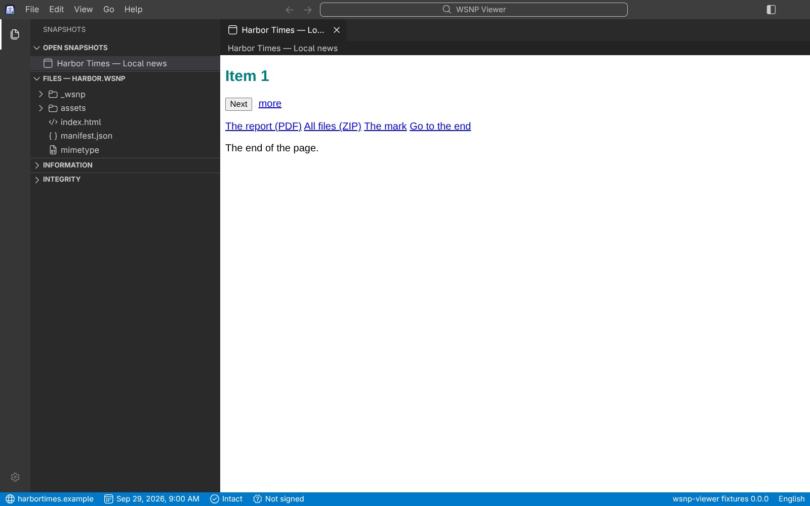
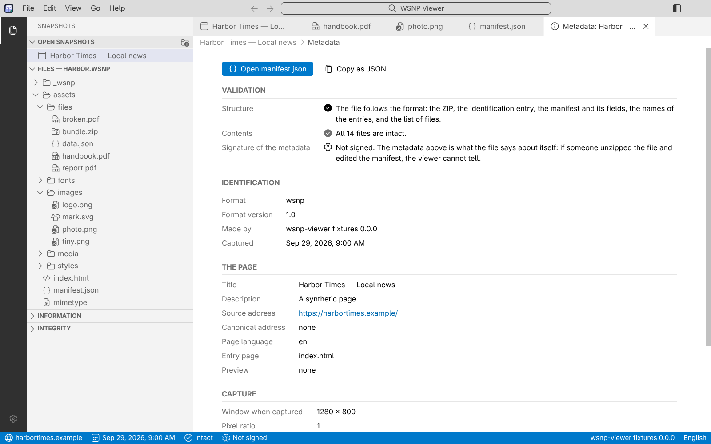

# User guide

WSNP Viewer opens **`.wsnp` files**: web pages saved by the [PageKeep](https://github.com/asantos43/webpage-snapshot) extension to be read offline. A `.wsnp`
is a **container**, a single file that holds a page, every file the page needs and a manifest that describes them. [Português do Brasil](USER-GUIDE.pt-BR.md).

## Opening files

- **Double-click** a `.wsnp` (the installers register the file type), or choose **File › Open File…** (`Ctrl+O`, `⌘O` on macOS).
- **Drag** one or more files onto the window.
- **File › Open Recent** lists the files you opened lately; **Clear Recently Opened** empties the list.
- Opening a second file while the application is running adds a tab to the same window. A file that is already open only shows its tab.

A file that cannot be opened says why, in words: for example "made by a newer version of the format", "password-protected, and this version cannot open
protected files yet", or "contains an application this viewer cannot run yet". An error stays on the screen until you dismiss it; an information goes by itself.

## The window

It is laid out like Visual Studio Code: a **title bar** with the menu, an **activity bar**, a **side bar**, the **tabs** with a path (breadcrumbs) under them, the
page or file in the middle, and a **status bar**. `Ctrl+B` hides and shows the side bar. Drag the edge of the side bar to resize it; the size is remembered.

### Tabs

- Each snapshot opens in a tab. A click on a file in the side bar opens a **preview tab** (its name in italics) that the next click replaces; a double click
  (or Enter) **keeps** it.
- Close with the × on the tab, a middle click or `Ctrl+W`. **Drag** a tab to move it. The tab's context menu has Close, Close Others, Close to the Right,
  Close All, Pin, **Show Metadata**, Copy Source Address (or Copy Path) and Reveal in File Manager.
- `Ctrl+Tab` goes through the tabs in the order you used them; `Alt+1…9` goes to the nth tab (`⌘1…9` on macOS).
- A snapshot keeps its state (scroll, a carousel on item 3) while you look at another tab.

### The side bar

- **Open Snapshots**: the snapshots that are open.
- **Files**: the files of the selected snapshot as a tree. Arrow keys move, typing jumps to a name, Enter keeps a file open, and the context menu has
  **Save As…** for every file.
- **Information**: where the page came from, when, and with what. **Show all metadata…** opens the full view.
- **Integrity**: the result of checking every file.

## What a tab can show

| File | What you get |
| --- | --- |
| The snapshot itself | The page, as it was, with the scripts of the format working (carousels, tabs, menus). |
| HTML, CSS, JavaScript, TypeScript, JSON, XML, Markdown, YAML, text, SVG | Source with colours and line numbers, read-only. A minified or one-line HTML, CSS, JavaScript, JSON or XML file is shown **laid out** (indented, one member to a line): the toolbar's **Format** button shows it as it was saved, and Save As always writes the file as it was saved. **Word Wrap** wraps long lines (`Alt+Z`). Both choices are for every file, are kept, and are in Settings too. A file over 2 MB is shown as saved. |
| Pictures | The picture with a **toolbar**: zoom out and in, a box (Fit, Fit Width, Fit Page, 25 % to 400 % and more), actual size (1:1), **Save As…**. `Ctrl` and the wheel zoom around the pointer, `+` `-` `0` zoom from the keyboard, and a zoomed picture is dragged. The zoom stays with the tab. |
| PDFs | The pages, one after the other, with selectable text, and a **toolbar**: the same zoom, previous and next page, a box to go to a page, **Save As…**. Not yet: links and forms inside the PDF, and a password for a protected PDF (it says so, and can be saved). |
| Fonts | A sample at several sizes. |
| Anything else (a ZIP, a document, audio, video, a file that is too large) | A page with its name, type and size, and **Save As…**. |

A click on a link **inside a page**: a `#section` link scrolls in the page; a link to a file saved in the snapshot opens a tab (a picture, a PDF, source) or offers
**Save As…** (a ZIP or a document); a link to the web opens your **default browser**, only when you click it, and never inside the page.

## Checking a file

The viewer checks a file when it opens it, and again in the background:

1. **Structure**: the ZIP, the identification entry, the manifest, the names of the entries, and that every file is listed.
2. **Contents**: the SHA-256 and the size of every file against the manifest (the status bar shows *Checking…*, then *Intact*).
3. **Signature**: whether the manifest is signed, and whether it is still what was signed.

### A snapshot that is not valid

A `.wsnp` is a ZIP, so anyone can unzip it, change a file or the manifest, and zip it again. If a file is not what the manifest says, or a signed manifest was edited,
the snapshot is **not valid**: its page is not shown. You see which files, and you choose **Show Anyway**, **Close Snapshot** or **Show Metadata**. The status bar says
*Invalid*.

### Signatures

PageKeep signs every `.wsnp` it writes with a key that stays in your browser. The viewer shows the **signer** as a fingerprint (`5647-5AA7-…`):

- **Not signed**: files written before PageKeep began to sign. They open, and the viewer says quietly that their metadata is not protected: someone could have edited it.
- **Signed by a key this viewer does not know yet**: the signature is good (the manifest was not edited after signing), but anyone can make a key. If you know it is yours
  (PageKeep's Help shows the fingerprint of yours), choose **Trust this signer** in **Show Metadata** and, if you like, give it a name.
- **Signed by** a name you gave: a key you trust. **Stop trusting** undoes it.

The design is in [`MANIFEST-SIGNING.md`](MANIFEST-SIGNING.md).

## Shortcuts

| Action | Windows, Linux | macOS |
| --- | --- | --- |
| Open File | `Ctrl+O` | `⌘O` |
| Close the tab | `Ctrl+W` | `⌘W` |
| Next / previous tab | `Ctrl+PageDown` / `Ctrl+PageUp` | `⌘PageDown` / `⌘PageUp` |
| Through the tabs, most recently used first | `Ctrl+Tab`, `Ctrl+Shift+Tab` | `⌃Tab`, `⌃⇧Tab` |
| Go to tab 1…9 | `Alt+1…9` | `⌘1…9` |
| Hide / show the side bar | `Ctrl+B` | `⌘B` |
| Settings | `Ctrl+,` | `⌘,` |
| Zoom the interface in / out / reset | `Ctrl+=` / `Ctrl+-` / `Ctrl+0` | `⌘=` / `⌘-` / `⌘0` |
| Word Wrap in a source tab | `Alt+Z` | `⌥Z` |
| Zoom a picture or a PDF | `Ctrl` + wheel, or `+` `-` `0` with the viewer focused | the same |

The shortcuts work wherever the focus is, also inside a page.

## Settings

**Settings** (the gear at the bottom of the activity bar, File › Settings, or `Ctrl+,`) opens in a tab, with a box that filters them:

- **Color Theme**: Dark+, Light+ or Auto, which follows the operating system.
- **Display Language**: English, Brazilian Portuguese or automatic (the system's). It changes at once.
- **Zoom Level**: the zoom of the whole interface, 20 % a step.

Settings are kept on your computer, in the application's own folder, and nowhere else. See [`../PRIVACY.md`](../PRIVACY.md).

## Help and About

**Help › About WSNP Viewer** shows the version, what it runs on, the licence and the notices of the libraries inside it, and copies the version information for a bug
report. Report a problem at <https://github.com/asantos43/wsnp-viewer/issues>, **without attaching a private snapshot**; a vulnerability goes the way [`../SECURITY.md`](../SECURITY.md) says.

## What is not here yet

Reading a plain ZIP saved by PageKeep and converting it, exporting to PNG, JPG and PDF, search, print, password protection, and `.wsnpx` come in later phases
([`ARCHITECTURE.md`](ARCHITECTURE.md), "Phases").
