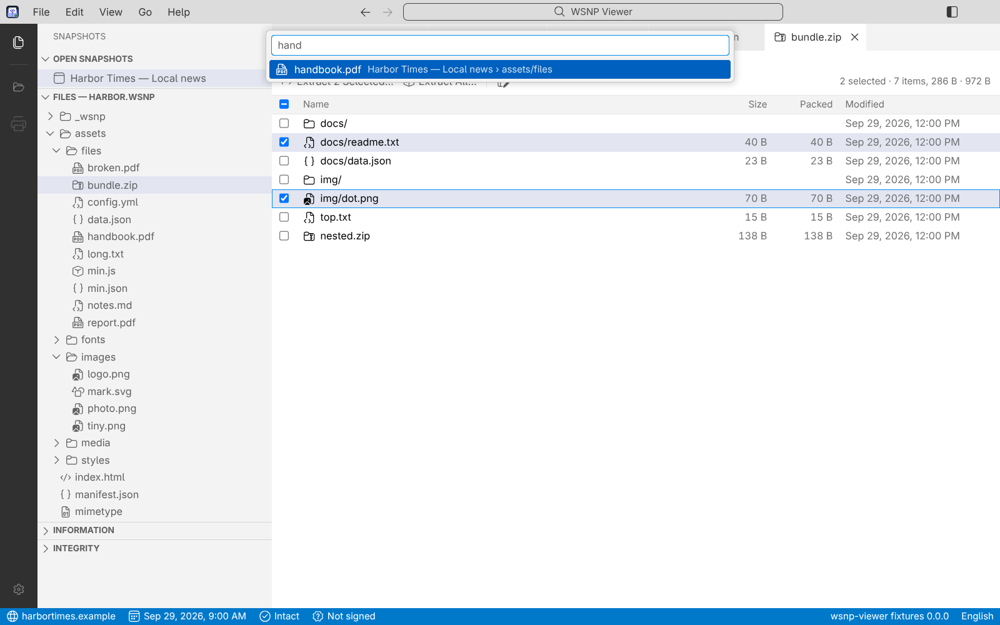
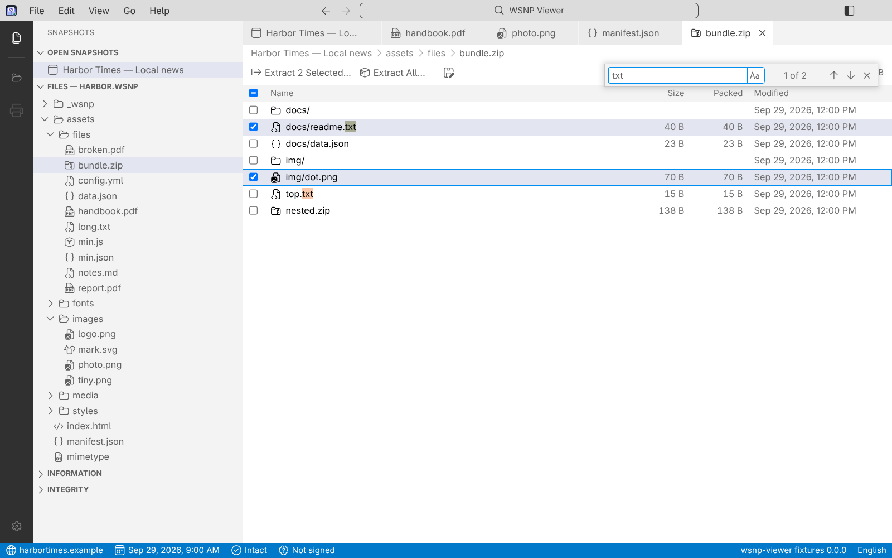

# User guide

WSNP Viewer opens **`.wsnp` files**: web pages saved by the [PageKeep](https://github.com/asantos43/webpage-snapshot) extension to be read offline. A `.wsnp`
is a **container**, a single file that holds a page, every file the page needs and a manifest that describes them. [Português do Brasil](USER-GUIDE.pt-BR.md).

## Opening files

- **Double-click** a `.wsnp` (the installers register the file type), or choose **File › Open File…** (`Ctrl+O`, `⌘O` on macOS).
- **Drag** one or more files onto the window.
- **File › Open Recent** lists the files you opened lately; **Clear Recently Opened** empties the list.
- Opening a second file while the application is running adds a tab to the same window. A file that is already open only shows its tab.
- The file picker lists **`.wsnp` and `.zip` files** first, and each kind alone; **All files** is the last choice.
- When the application starts with no file to open, it **opens again what was open** when it was closed, in the same order and with the same tab in front
  (**Settings ▸ Reopen the files that were open**; turn it off and nothing is kept). A file named on the command line, or double-clicked, opens alone.

### A ZIP saved by an older PageKeep

Before `.wsnp` existed, PageKeep saved a page as a plain ZIP. The viewer opens those too: choose the `.zip` in **Open File…**, drop it on the window, or double-click it with the viewer.

- It is **converted to a `.wsnp`** (a temporary file, deleted when you close the tab) and shown like any snapshot, with a bar over the page that says
  "This is a ZIP saved by PageKeep … The original file is not changed."
- **Details** in the bar lists what the conversion had to remove to make the page safe (scripts and references that would load from the internet) and what the ZIP did not record
  (the window's size and pixel ratio: 1280 × 800 and 1 are assumed).
- **Save as .wsnp…** (the button, or **File ▸ Save as .wsnp…**) writes the converted file where you choose, after it passes the same checks as any `.wsnp`. The ZIP is never changed.
- A ZIP that is not PageKeep's, or whose `snapshot.json` cannot be used, is refused in words.

A file that cannot be opened says why, in words: for example "made by a newer version of the format", "password-protected, and this version cannot open
protected files yet", or "contains an application this viewer cannot run yet". An error stays on the screen until you dismiss it; an information goes by itself.

## The window

It is laid out like Visual Studio Code: a **title bar** with the menu, an **activity bar**, a **side bar**, the **tabs** with a path (breadcrumbs) under them, the
page or file in the middle, and a **status bar**. `Ctrl+B` hides and shows the side bar. Drag the edge of the side bar to resize it; the size is remembered.

### The title bar

- The **arrows** are **Go Back** and **Go Forward**: they walk through the tabs you visited, as in a browser (`Alt+Left`, `Alt+Right`; on macOS `⌃-` and `⌃⇧-`). They are off when there is nowhere to go.
- The **box in the middle** opens **Go to File** (`Ctrl+E`): type part of a name to open a file of any open snapshot (with nothing typed it lists your tabs, the latest first).
  Type `>` (or press `Ctrl+Shift+P`) for the **command palette**: every command of the menus that can run now, and the colour themes.
- The menu is on its left (File, Edit, View, Go, Help); the side bar button is on the right.

### The address of a link

Rest the pointer on a link in a page and its address shows beside it, as a tooltip: the web address, the path of a file of the snapshot, or `#fragment` for a link inside the page. Nothing is opened until you click.

### Zoom

Zoom belongs to the **tab**, never to the whole application (the interface, the menus and the other tabs stay as they are):

- **The page of a snapshot** zooms as a browser's page does (25 % to 500 %): the text grows and the layout is redone for the narrower room. Use `Ctrl+=`, `Ctrl+-` and `Ctrl+0` (`⌘` on macOS), or `Ctrl` and the wheel, also while the pointer or the keyboard focus is inside the page.
- **A text file** is drawn at the tab's zoom, the same way.
- **A picture or a PDF** keep their own zoom, with a toolbar and fit modes; the same keys step it (`Ctrl+0` fits it again) and the wheel zooms around the pointer.
- For a page or a text, the **status bar** has zoom controls at the right: **−**, the level (click it to go back to 100 %) and **+**. They move the same zoom as the keys and the wheel, and show it when those change it. A closed tab forgets its zoom.
- Zoom In, Zoom Out and Reset Zoom are in the command palette (`Ctrl+Shift+P`), not in the View menu.

### Tabs

- Each snapshot opens in a tab. A click on a file in the side bar opens a **preview tab** (its name in italics) that the next click replaces; a double click
  (or Enter) **keeps** it.
- Close with the × on the tab, a middle click or `Ctrl+W`. **Drag** a tab to move it. The tab's context menu has Close, Close Others, Close to the Right,
  Close All, Pin, **Show Metadata**, Copy Source Address (or Copy Path) and Reveal in File Manager.
- `Ctrl+Tab` goes through the tabs in the order you used them; `Alt+1…9` goes to the nth tab (`⌘1…9` on macOS).
- A snapshot keeps its state (scroll, a carousel on item 3) while you look at another tab.

### The side bar

- **Open Snapshots**: the snapshots that are open.
- **Files**: the files of the selected snapshot as a tree. Arrow keys move, typing jumps to a name, Enter keeps a file open, and the context menu has
  **Open**, **Open With…** and **Save As…** for every file. **Open With…** asks your system which application should open the file (Windows' "Open with" dialog, macOS's chooser,
  and on Linux a dialog of the viewer's own, drawn as the desktop's is, with the applications registered for the file's type first, then all the others, a search box, and **Always use for this file type**, which makes the choice the default of the desktop; the desktop's own chooser opens behind a program's window on Wayland, which is why the viewer draws it. Where a system has no way to choose (no `gio`), the default application is used and the viewer says so). The application is given a **read-only copy** in your temporary folder,
  removed when the viewer quits. A kind of file that can run as a program (`.exe`, `.bat`, `.sh`, `.desktop`, `.jar`…) is never handed over: use **Save As…**.
- **Information**: where the page came from, when, and with what. **Show all metadata…** opens the full view.
- **Integrity**: the result of checking every file.

## What a tab can show

| File | What you get |
| --- | --- |
| The snapshot itself | The page, as it was, with the scripts of the format working (carousels, tabs, menus). |
| HTML, CSS, JavaScript, TypeScript, JSON, XML, Markdown, YAML, text, SVG, and source in Python, C, C++, C#, Java, Kotlin, Scala, Go, Rust, Swift, Dart, PHP, Ruby, Perl, Lua, R, Groovy, Haskell, Julia, Clojure, Erlang, Pascal (`.pas`, `.pp`, `.dpr`, `.lpr`, `.inc`), shell (`.sh`, `.bash`, `.zsh`), PowerShell, SQL, TOML, INI and `.env`, Dockerfile, CMake, Diff, Protocol Buffers, SCSS, Sass, Less | Source with colours and line numbers, read-only. A minified or one-line HTML, CSS, JavaScript, JSON or XML file is shown **laid out** (indented, one member to a line): the toolbar's **Format** button shows it as it was saved, and Save As always writes the file as it was saved. **Word Wrap** wraps long lines (`Alt+Z`). Both choices are for every file, are kept, and are in Settings too. A file over 2 MB is shown as saved. |
| Pictures | The picture with a **toolbar**: zoom out and in, a box (Fit, Fit Width, Fit Page, 25 % to 400 % and more), actual size (1:1), **Save As…**. `Ctrl` and the wheel zoom around the pointer, `+` `-` `0` zoom from the keyboard, and a zoomed picture is dragged. The zoom stays with the tab. |
| PDFs | The pages, one after the other, with selectable text, and a **toolbar**: the same zoom, previous and next page, a box to go to a page, **Save As…**. Not yet: links and forms inside the PDF, and a password for a protected PDF (it says so, and can be saved). |
| Fonts | A sample at several sizes. |
| SVG | A **picture** at first, with its zoom toolbar; the **Image / Code** buttons at the start of the toolbar switch to the source (coloured as XML, with Find, Word Wrap and the tab's zoom) and back. The choice is kept for every SVG. |
| A text file in the wrong language | The status bar shows the language of the file on screen (next to the interface language). Click it for **Select Language Mode**: a list of every language the viewer can colour, to pick the right one for that file (**Auto Detect** goes back to what the viewer chose). The choice lasts while the window is open and never changes the file. |
| Markdown (`.md`) | A **formatted page** at first (headings, lists, tables, code; a web link opens in your browser; a picture is not loaded, its description is shown instead, and HTML written inside is shown as text); the **Formatted / Text** buttons at the start of the toolbar switch to the text (with colours, Find and Word Wrap) and back. The choice is kept for every Markdown file. **Full Width** makes the page as wide as the window (no scroll bar in a wide code block) and **Wrap Code** wraps long lines of code; both are kept. |
| A file of a kind the viewer does not know (`.py`, `.sh`, `.toml`, `LICENSE`, a ZIP's entry with an odd extension) | Shown as text when what it holds is text; otherwise offered with Save As. |
| ZIP files | The **list of files** in the ZIP, with sizes and dates: see "ZIP files" below. |
| Anything else (a document, audio, video, a file that is too large) | A page with its name, type and size, and **Save As…**. |

A click on a link **inside a page**: a `#section` link scrolls in the page; a link to a file saved in the snapshot opens a tab (a picture, a PDF, source) or offers
**Save As…** (a document or a video); a ZIP opens as a list; a link to the web opens your **default browser**, only when you click it, and never inside the page.

### ZIP files

A ZIP saved in a snapshot opens as a **list of its files**: name, size, packed size and date. Nothing is written to disk until you extract.

- **Select** as in a file manager: click, `Ctrl`+click, `Shift`+click, the boxes, the box in the header for all, `Ctrl+A`, arrows and `Space` from the keyboard.
- **Extract Selected…** writes the selection to a folder you choose (folders of the ZIP are kept). One file asks for a file name instead, as Save As does.
  **Extract All…** writes everything. A file that is already there is never overwritten: the new one is called `name (2)`.
- **View** (double click, `Enter`, or the context menu) opens an entry in a tab of its own: text as source, a picture, a PDF, and a ZIP inside the ZIP as a list again.
  The tab's **Save As…** saves that entry.
- The right click on a row opens a menu with **View** and **Extract…** (for several rows, **Extract N Selected…**).
- The viewer will not write a name that could leave the folder you chose (`../x`, an absolute path), will not follow links, and cannot open an entry protected with a password:
  they are shown dimmed, with the reason when you point at them, and skipped (and counted) when you extract. A ZIP over 256 MB is only offered with Save As.

## Finding, copying, printing and saving as PDF

- **Find** (`Ctrl+F`, **Edit ▸ Find**) works in every tab that has text: the page of the snapshot, a source file (over the whole text, not only the lines in view), a PDF (over every page),
  a ZIP's list, the metadata and Settings. The box says which match of how many; `Enter` and `Shift+Enter` (or the arrows) go to the next and the previous, **Aa** matches the case,
  `Esc` closes. Each tab has its own search: the box closes when you change tab. A picture has no text, so Find is off there.
- **Copy** (**Edit ▸ Copy**, or `Ctrl+C`) copies what is selected in the page, a source file, a PDF, or the lists and texts of the viewer itself. Text in all of them can be selected with the mouse.
- **Print** (**File ▸ Print…**, `Ctrl+P`, or the printer icon in the activity bar) prints the page of the snapshot as saved, an HTML file of the snapshot as the page it is, any other text as the tab shows it
  (laid out or as saved), or a picture, with the system's print dialog. A ZIP's list, a PDF and the metadata cannot be printed yet.
- **Save as PDF…** (**File ▸ Save as PDF…**) writes the same thing as a PDF, named after the page's title or the file, where you choose.
- A **right click** in the page of a snapshot opens a menu with **Select All**, **Copy**, **Print…** and **Save as PDF…**; in a text file, with **Select All** and **Copy**.
- **Open File** is also an icon in the activity bar, above the printer.

## Checking a file

The viewer checks a file when it opens it, and again in the background:

1. **Structure**: the ZIP, the identification entry, the manifest, the names of the entries, and that every file is listed.
2. **Contents**: the SHA-256 and the size of every file against the manifest (the status bar shows *Checking…*, then *Intact*).
3. **Signature**: whether the manifest is signed, and whether it is still what was signed.

### A snapshot that is not valid

A `.wsnp` is a ZIP, so anyone can unzip it, change a file or the manifest, and zip it again. If a file is not what the manifest says, or a signed manifest was edited,
the snapshot is **not valid**: its page is not shown. You see which files, and you choose **Show Anyway**, **Close Snapshot** or **Show Metadata**. The status bar says
*Invalid*.

### Signatures

PageKeep signs every `.wsnp` it writes with a key that stays in your browser. The viewer shows the **signer** as a fingerprint (`5647-5AA7-…`):

- **Not signed**: files written before PageKeep began to sign. They open, and the viewer says quietly that their metadata is not protected: someone could have edited it.
- **Signed by a key this viewer does not know yet**: the signature is good (the manifest was not edited after signing), but anyone can make a key. If you know it is yours
  (PageKeep's Help shows the fingerprint of yours), choose **Trust this signer** in **Show Metadata** and, if you like, give it a name.
- **Signed by** a name you gave: a key you trust. **Stop trusting** undoes it.

The design is in [`MANIFEST-SIGNING.md`](MANIFEST-SIGNING.md).

## Shortcuts

| Action | Windows, Linux | macOS |
| --- | --- | --- |
| Open File | `Ctrl+O` | `⌘O` |
| Close the tab | `Ctrl+W` | `⌘W` |
| Next / previous tab | `Ctrl+PageDown` / `Ctrl+PageUp` | `⌘PageDown` / `⌘PageUp` |
| Through the tabs, most recently used first | `Ctrl+Tab`, `Ctrl+Shift+Tab` | `⌃Tab`, `⌃⇧Tab` |
| Go to tab 1…9 | `Alt+1…9` | `⌘1…9` |
| Hide / show the side bar | `Ctrl+B` | `⌘B` |
| Settings | `Ctrl+,` | `⌘,` |
| Zoom the tab in / out / reset (the page, a text; a picture or a PDF steps its own) | `Ctrl+=` / `Ctrl+-` / `Ctrl+0`, or `Ctrl` + wheel | `⌘=` / `⌘-` / `⌘0`, or `⌘` + wheel |
| Word Wrap in a source tab | `Alt+Z` | `⌥Z` |
| Go Back / Go Forward | `Alt+Left` / `Alt+Right` | `⌃-` / `⌃⇧-` |
| Go to File | `Ctrl+E` | `⌘E` |
| Command palette | `Ctrl+Shift+P` | `⇧⌘P` |
| Find in the tab | `Ctrl+F` | `⌘F` |
| Copy | `Ctrl+C` | `⌘C` |
| Print | `Ctrl+P` | `⌘P` |
| Zoom a picture or a PDF around the pointer | `Ctrl` + wheel, or `+` `-` `0` with the viewer focused | the same |

The shortcuts work wherever the focus is, also inside a page.

## Settings

**Settings** (the gear at the bottom of the activity bar, File › Settings, or `Ctrl+,`) opens in a tab, with a box that filters them:

- **Color Theme**: Dark+, Light+ or Auto, which follows the operating system.
- **Display Language**: English, Brazilian Portuguese or automatic (the system's). It changes at once.

Settings are kept on your computer, in the application's own folder, and nowhere else. See [`../PRIVACY.md`](../PRIVACY.md).

## Help and About

**Help › About WSNP Viewer** shows the version, what it runs on, the licence and the notices of the libraries inside it, and copies the version information for a bug
report. Report a problem at <https://github.com/asantos43/wsnp-viewer/issues>, **without attaching a private snapshot**; a vulnerability goes the way [`../SECURITY.md`](../SECURITY.md) says.

## What is not here yet

Reading a plain ZIP saved by PageKeep and converting it, exporting to PNG, JPG and PDF, search across all open snapshots, password protection, and `.wsnpx` come in later phases
([`ARCHITECTURE.md`](ARCHITECTURE.md), "Phases").
